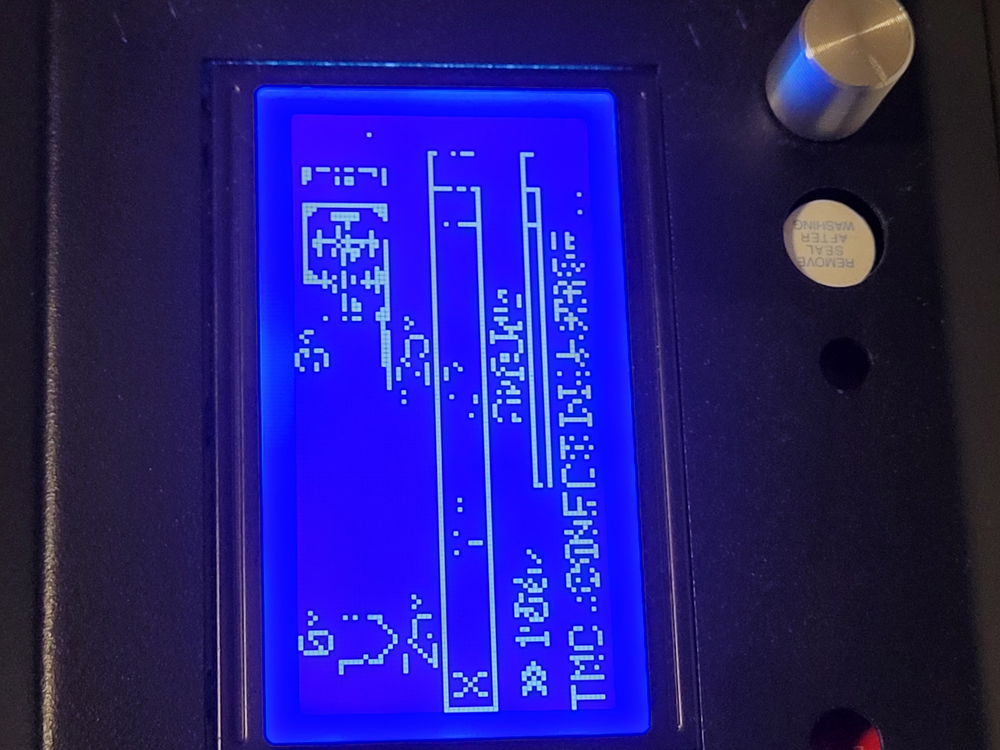

# Tevo Tornado Configuration

Printer spec:https://www.tevo.cn/products/3d-printers/tevo-tornado/

Latest firmware update produce 2 bugs:

1. TMC2209 v2 driver report error
1. Display will unreadable

## TMC2209 Error

```sh
Send: M122
Recv: Testing X connection... Error: All LOW
Recv: Testing Y connection... Error: All LOW
Recv: Testing Z connection... Error: All LOW
Recv: Testing E connection... Error: All LOW
```

## Display bug

The following configuration produces a messy screen using Marlin 2.0 firmware


